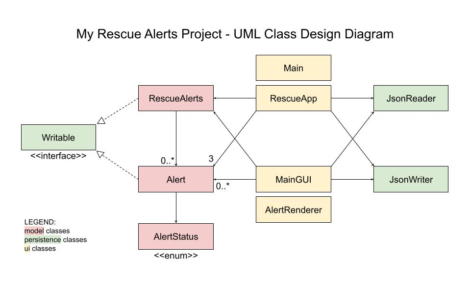

# My Personal Project, August 2021

## A Disaster Rescue Alert Application

      
- [RescueAlerts GUI Demo](https://youtu.be/C2gVOZ__9Wo)
- [YouTube video for user interface on terminal](https://youtu.be/2Pru6Y3MMGk)

This app was inspired by a deficit I saw in the disaster rescue responses of 
different areas in the Philippines. Last 2019, when **Typhoons Ulysses and Rolly (a.k.a. Typhoons 
Vamco and Goni) hit the Philippines**, posts of people in need of rescue flooded my social media 
timelines. These posts would contain important information regarding the rescuees such as an exact 
location, contact number, or whether they were with an injured or elderly person. 
Simultaneously, there were photos of civilian rescuers –among them Filipino celebrities 
Jericho Rosales and Kim Jones – that were using their personal surfboards or kayaks to 
rescue those Filipinos in need.

I created an application that answers this rescue response deficit by establishing a platform 
through which people can **post, view, and respond to rescue alerts**. On it, 
users can see a list of posted rescue alerts, and decide whether they wish 
to add a new alert, view a current alert, or respond to an alert (thereby rescuing them!). 
Every alert contains the same recurring information that I identified in the 
Typhoon Ulysses/Rolly social media posts – such as name, contact number, 
location, and number of people in location. Currently, I am only aware of this 
kind of deficit being present in the Philippines, so I included some Filipino 
terms in the UI ("*Mabuhay*" = welcome, "*kapwa kababayan*" = fellow citizens). 
Thus, this app is intended for Filipino users, but may extend to other 
nations should the need arise. This application may be **utilized in various natural 
disasters** (typhoons, earthquakes, floods, etc.) wherein citizens are 
in need of rescue and other people with the proper resources can help.

## User Stories

- As a user, I want to be able to add a rescue alert to a list of rescue alerts 
  containing the necessary information.
- As a user, I want to be able to see a list of the rescue alerts posted on the app 
  with their *respective statuses and locations.
- As a user, I want to be able to select a rescue alert and view it in detail.
- As a user, I want to be able to load already-posted rescue alerts from file.
- As a user, I want to be able to save my updated rescue alerts to file.
- As a user, I want to be able to respond to a posted rescue alert and change its status. ^
- As a user, I want to be reminded to save to file and have the option to do so before I quit the application. ^

> *respective statuses include:
> 1. 🔴 NEED HELP
> 2. 🟡 HELP ON THE WAY
> 3. 🟢 RESCUED

> ^ these user stories were implemented in terminal UI, but not in Java Swing-based GUI

## Integrating an OOP Principle: Robustness
I chose to implement two robust classes: Alert and RescueAlerts.

In **_Alert_**, two methods throw checked exceptions: the Alert constructor and getNextStatus().
- The **Alert constructor** throws an _InvalidNumPeopleException_ when there is an amount of 0 or a negative 
  amount of people passed into the numPeople argument.
- The **getNextStatus()** method throws an _AlreadyRescuedException_ when the status of the alert is already RESCUED.
  
In **_RescueAlerts_**, one method throws a checked exception: getAlertById(int).
- The **getAlertById(int)** method throws an _InvalidIdCodeException_ when no id code in the list of alerts
  of RescueAlerts matches the given argument (i.e. the Alert matching the given id code cannot be found).

## Areas of Improvement
- If I had more time to work on my project, I would have added the functionality of responding to an alert
  to my GUI. I also would have implemented my other user story where users
  are reminded to save before quitting the application.
- I also would have liked to refactor my MainGUI and RescueApp ui classes into multiple subclasses.
  That way, the design of my overall project would have higher cohesion.
- Additionally, instead of storing Alerts in an ArrayList in my RescueAlerts class, I would rather
  store them in a Hashmap, where the 'key' is the idCode and the 'value' is the actual Alert object.
  This would make it easier to find and access a specific alert from a list,
  especially when using a method such as getAlertById(int).
  

## UML Design Diagram of RescueAlerts Interfaces & Classes

